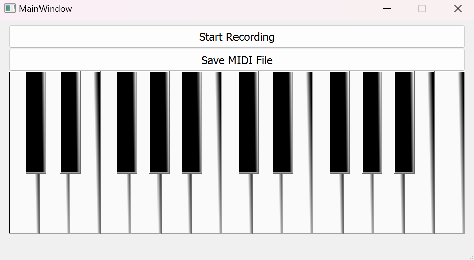

# **Virtual Piano**

A MIDI Keyboard Recording Application with a Graphical User Interface (GUI) built using PyQt5, supporting MIDI device interaction and real-time sound playback.

---

## **Description**

The **Virtual Piano** application is a desktop tool that allows users to play and record music using a virtual keyboard, external MIDI devices, or their computer keyboard. It offers an intuitive interface for interacting with the piano and allows for real-time sound playback and MIDI recording. Users can save their recordings in a standard `.mid` file, which can be opened in any digital audio workstation (DAW).

The project also provides a pre-built executable (`main.exe`), making it easy for non-developers to run the application without requiring Python or any other external libraries.

---

## **Features**

- **MIDI Device Support**: Automatically detects and supports connected MIDI devices for input.
- **Virtual Piano**: Interactive piano interface built with PyQt5, with visual and audio feedback for every note played.
- **Real-Time Audio Playback**: Immediate sound playback with each key press (both virtual and MIDI devices).
- **Recording Functionality**: Users can record and save their music as a standard `.mid` file.
- **Dynamic Note Mapping**: Correct MIDI pitches mapped to the corresponding keys on the virtual piano.
- **GUI for Ease of Use**: A user-friendly graphical interface that allows easy interaction with the virtual keyboard, recording buttons, and more.
- **MIDI File Export**: After recording, the session is saved as a `.mid` file in the `recordings/` folder.

---

## **Installation and Setup**

### 1. For All Users: Run `main.exe`

Whether you're a regular user or developer, you can run the application with the provided `.exe` file. There is no need for Python or additional setup. Simply follow these steps:

1. **Download the Project Archive**  
   Download the latest release from the [Releases](https://github.com/Glooring/virtual-piano/releases) page or directly using [this link](https://github.com/Glooring/virtual-piano/releases/download/v1.0.0/virtual-piano-v1.0.0.zip), which includes the `virtual-piano-v1.0.0` folder containing `main.exe` and all necessary internal dependencies.

2. **Extract the Zip File**  
   After downloading the `.zip` file, extract its contents to a location on your computer.

3. **Run the Application**  
   Navigate to the `virtual-piano-v1.0/` folder and double-click `main.exe` to launch the Virtual Piano.

---

### 2. For Developers: Run the Project in Python

If you want to run the project in development mode or modify it, follow these steps:

1. **Download or Clone the Repository**  
   You can either download the entire project archive from the repository or clone it using the following command:
   ```bash
   git clone https://github.com/Glooring/virtual-piano.git
   cd virtual-piano
   ```

2. **Install Dependencies**  
   Install the required dependencies using `pip`:
   ```bash
   pip install -r requirements.txt
   ```

3. **Run the Application**  
   Once the dependencies are installed, run the application using:
   ```bash
   python main.py
   ```
---

## **Project Structure**

The project is organized into the following components:

```
Virtual-Piano/
│
├── gui/                         # Folder for GUI-related files
│   └── main.ui                  # PyQt5 .ui file used to generate the GUI
├── notes/                       # Folder containing .wav files for piano notes
│   ├── A3.wav                   # Example note file
│   ├── A3s.wav                  # Example note file
│   ├── A4.wav                   # Example note file
│   └── ...                      # Additional note files
├── recordings/                  # Folder for storing generated MIDI files
│   └── output.mid               # Example output MIDI file (created upon recording)
├── screenshots/                 # Folder containing screenshots for the README and documentation
├── tools/                   # Additional assets like icons or images
│   ├── cleanup_build.py          # Script to delete files listed in a text file
│   └── cleanup_files.txt      # List of files to be deleted
├── LICENSE                      # License for the project
├── README.md                    # Project documentation (this file)
├── main.py                      # Main script to launch the application
└── requirements.txt             # Python dependencies for development purposes


```
---
   
## **Generating the `main.py` from `main.ui`**

The graphical user interface (GUI) is built using PyQt5. The design is stored in a `.ui` file (in this case, `main.ui`), which can be edited using the Qt Designer.

If you modify the `main.ui` file and want to regenerate the corresponding Python file, run the following command:

```bash
pyuic5 -x gui/main.ui -o main.py
```

This command will generate the Python code (`main.py`) based on the structure defined in `main.ui`.

---

## **Building the `main.exe` Executable**

To generate the standalone `main.exe` executable, follow these steps:

1. **Ensure the project structure is correct**:  
   Make sure all dependencies and folders (like `gui`, `notes`, `resources`, etc.) are properly set up.

2. **Run PyInstaller**:  
   Use the following command to generate the `main.exe` file:
   ```bash
   pyinstaller --onedir --noconsole main.py
   ```

   This will create a `dist/` folder containing a `main/` directory, which holds the `main.exe` executable along with all necessary dependencies.

### Build Cleanup Utility

After running the PyInstaller command to build the `main.exe` file, some unnecessary files may be generated in the `_internal` folder. These files can be safely deleted to reduce the release folder size.

To help streamline the process of removing unnecessary dependencies after the build, I’ve provided a utility script that automates the cleanup.

### How to Use the `cleanup_build.py` Script:

1. **Prepare the List**  
   The list of unnecessary files is already provided in `tools/cleanup_files.txt`.

2. **Run the Script**  
   Use the following command to clean up the unnecessary files:

   ```bash
   python tools/cleanup_build.py
   ```

   The script will ask you for:
   - The path to the `_internal` folder (e.g., `dist/main/_internal/`).
   - The path to the `cleanup_files.txt` file (automatically defaults to `tools/cleanup_files.txt`).

3. **What the Script Does**  
   The script will delete all listed files from the specified `_internal` folder, helping reduce the overall folder size.

---

## **How to Use the Virtual Piano Application**

1. **Main Interface**  
   Once the application is launched, the main virtual piano interface will be displayed. Users can interact with the piano using a MIDI controller, the computer keyboard, or the mouse.

   #### Example Screenshot:
   

2. **Recording and Playback**  
   Use the interface to start and stop recording, and the session will be saved as a `.mid` file in the `recordings/` folder.

---

## **Dependencies**

- **PyQt5**: Used for the graphical user interface.
- **pygame.midi**: Facilitates communication with MIDI devices.
- **midiutil**: For handling MIDI file creation and manipulation.
- **playsound**: Plays the `.wav` sound files for each note in real-time.
- **threading**: Ensures audio playback happens asynchronously without blocking the GUI.

Install all dependencies using the `requirements.txt` file:

```bash
pip install -r requirements.txt
```

---

## **Contributing**

Contributions are welcome! Please fork the repository, make your changes, and submit a pull request.

---

## **License**

This project is licensed under the MIT License. See the [`LICENSE`](LICENSE) file for more details.
